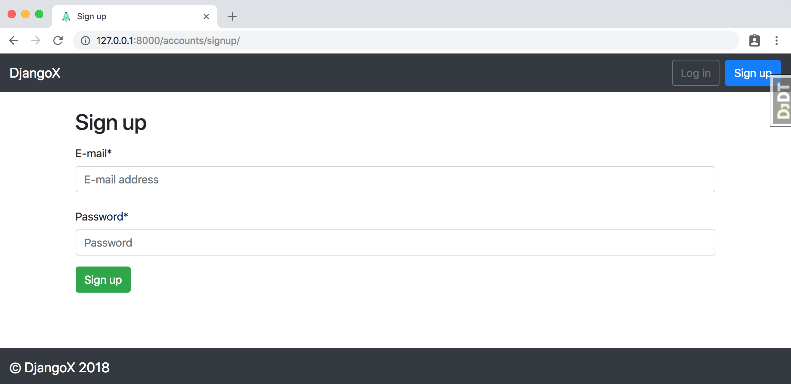

# Chit-fund

Chit fund management app in django


## Features

- For Django 2.1 and Python 3.7
- Modern virtual environments with [pipenv](https://github.com/pypa/pipenv)
- Styling with [Bootstrap](https://github.com/twbs/bootstrap) v4.1.3
- Custom user model
- Email/password for log in/sign up instead of Django's default username/email/password pattern
- Social authentication via [django-allauth](https://github.com/pennersr/django-allauth)
- [django-debug-toolbar](https://github.com/jazzband/django-debug-toolbar)

## First-time setup

1.  Make sure Python 3.7x and Pipenv are already installed.
2.  Clone the repo and configure the virtualenv:

```
$ git clone https://github.com/rajeshr188/chit-fund.git
$ cd djangox
$ pipenv install
$ pipenv shell
```

3.  Set up the initial migration for our custom user models in `users` and build the database.

```
(djangox) $ python manage.py makemigrations users
(djangox) $ python manage.py migrate
```

4.  Create a superuser:

```
(djangox) $ python manage.py createsuperuser
```

5.  Confirm everything is working:

```
(djangox) $ python manage.py runserver
```

Load the site at [http://127.0.0.1:8000](http://127.0.0.1:8000).



